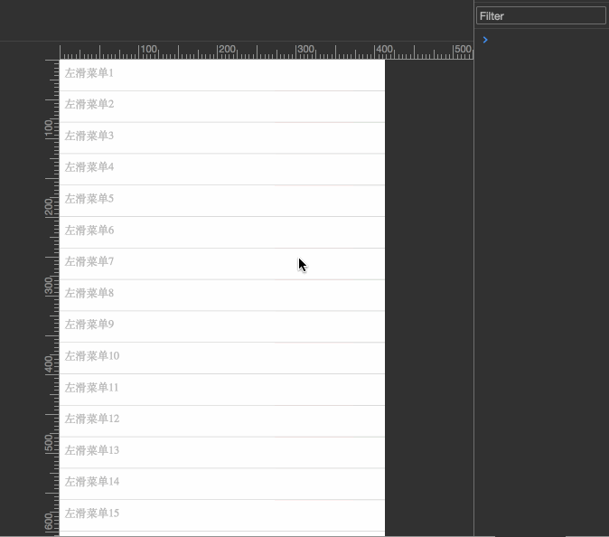

# swipe-left
左滑菜单组件

### Usage

    import SwipeLeft from "./SwipeLeft";
    
    const sl = new SwipeLeft();
    
    sl.init(selector(String), Array.<Object>);

    demo:
    
    import SwipeLeft from "./SwipeLeft";

    //  实例化一个SwipeLeft对象
    const sl = new SwipeLeft();
    
    //  配置参数, menus
    sl.init(".menus", {
        menus: [{
            "text": "删除",
            "classes": ["on", "test"],
            "css": {
            	"font-size": "14px",
            	"width": "100px",
            	"background-color": "red"
            },
            handler: (e) => {
            	if(confirm("你确定删除此项吗?")) {
            		e.el.parentNode.parentNode.removeChild(e.el.parentNode);
            	}
            }
        }, {
            "text": "新增",
            "classes": "text-calss",
            "css": {
            	"font-size": "14px",
            	"background-color": "green"
            },
            handler: (e) => {
            	alert("即将新增一项");
            }
        }]
    });

### 参数解释

属性名 | 参数类型 | 默认值 | 意义
---|---|---|---
text | String | N/A | 显示在菜单按钮上的文字
classes | Array.<String>/String | N/A | 自定义样式类, 当为数组时,表示同时添加多个样式类
css | Object | {} | 自定义样式
handler | Function | function() {} | 菜单项被轻击之后的函数响应

####  注:

本项目中的事件依赖于本人的另一项目([Toucher](https://github.com/rwson/Toucher))实现
